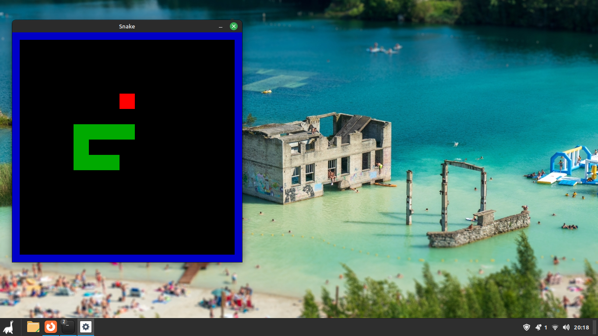

# Snake
## What?
A really basic game of snake made with c++ and SDL library.

## Why?
After ""learning"" c++ for the first year of college, I switched to c because it is simpler and it made more sense. Now, after taking PdeP (programming paradigms¿) in college and getting to know OOP better, I undestand (some of) the advantages c++ brings to the table. Overall, a fun experience.

## Photo

