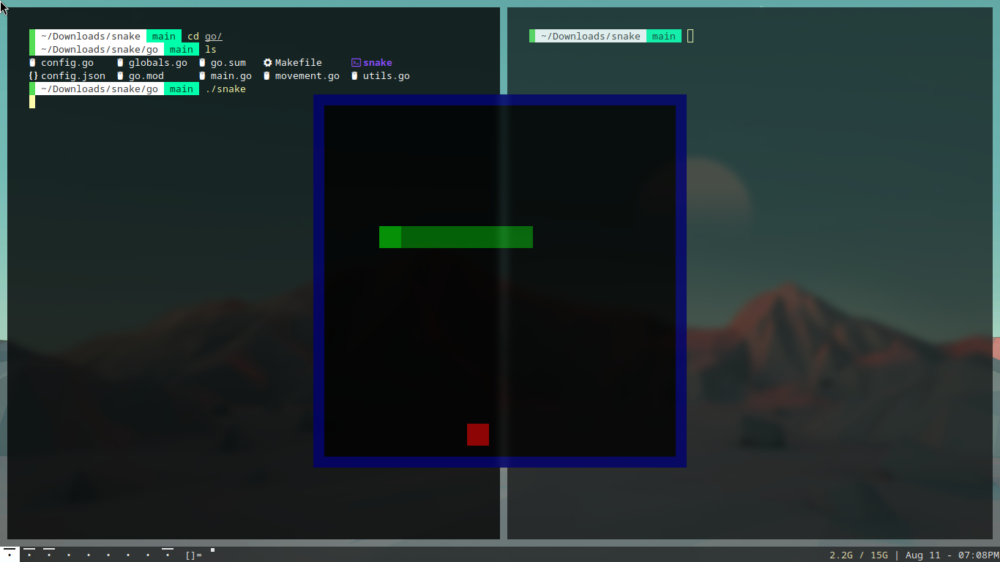

# snake
Implementations of the snake game using SDL2. First I made this in c++, now, in go. They are basically the same game though. The go implementation does have a json file with configurations, which is nice.

# image

